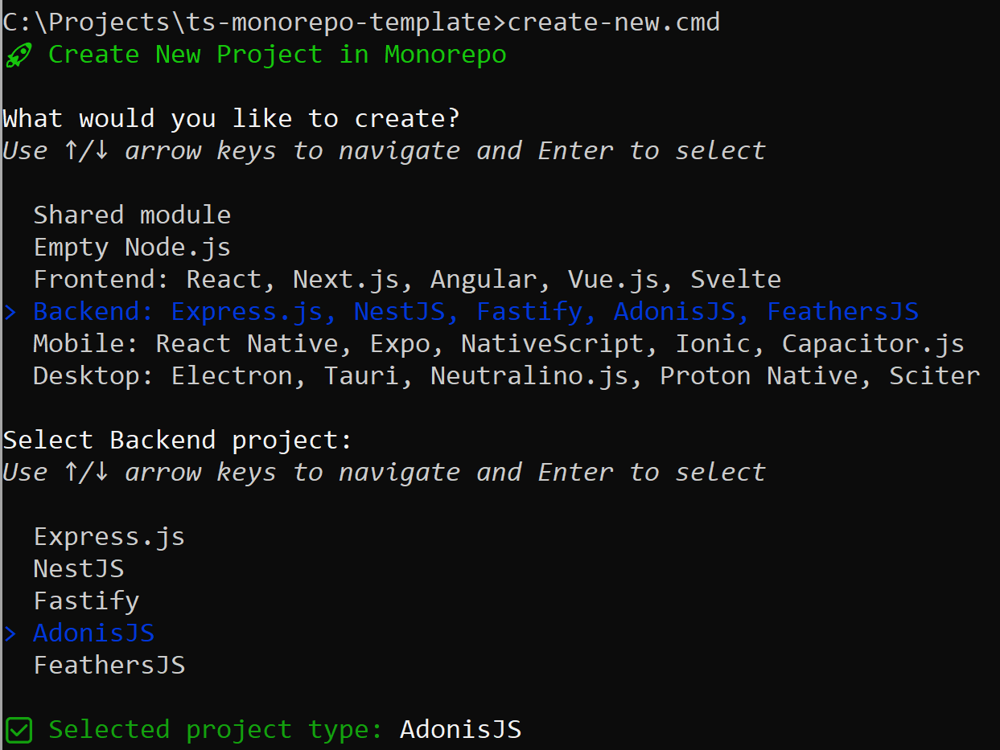

# TypeScript Monorepo

[](https://t.me/ts_monorepo)

A **monorepo** (monolithic repository) is a software development strategy where code for multiple projects is stored in the same repository. This approach brings multiple projects together under one roof, offering key benefits. It enables streamlined code sharing between projects with direct access to shared modules, simplifies dependency management through centralized versioning, and allows atomic changes across projects for coordinated updates. Monorepos also provide unified tooling and configuration for consistent standards across the ecosystem.

This approach is especially valuable for individual developers managing multiple interconnected projects, small teams seeking to reduce overhead, and early-stage projects that need flexibility to evolve rapidly.

TypeScript monorepos typically face challenges like cross-project type sharing, proper references configuration, efficient build systems, and consistent path aliases. This template provides a lightweight solution that minimizes dependencies while delivering robust development tooling.

## Advantages of This Monorepo

- **Lightweight** - Uses the standard workspaces mechanism of the standard npm manager, without heavy external orchestration tools, making the resulting repository easy to understand, use, and maintain

- **Project Scaffolding** - Interactive CLI tool for initialization and creating new projects/modules with proper configuration

- **Multi-Framework Support** - Ready-to-use templates for popular frameworks (React, Vue, Angular, Express, NestJS, React Native, Electron, etc.)

- **Shared System** - Automatic symlink creation to shared modules with proper TypeScript path resolution

- **VS Code Integration** - Pre-configured debugging, tasks, and settings optimized for monorepo development

## Quick Start

1. **Create your monorepo**:
   ```bash
   # You can create the mymonorepo directory like this:
   npm create ts-monorepo mymonorepo
   
   # But I recommend doing it like this:
   npx --yes create-ts-monorepo mymonorepo
   ```
   The `create-ts-monorepo` tool accepts other parameters in addition to the `directory` name. You can learn more about them [here](https://github.com/d-mozulyov/create-ts-monorepo). For more detailed discussion of the project, you can join the Telegram group [TypeScript Monorepo](https://t.me/ts_monorepo).

2. **Build the app example project**:
   ```bash
   npm run build       # Build all applications
   npm run build:app   # Build "app" application
   ```
   This monorepo features a comprehensive set of standard scripts (detailed in the _"Standard Package Scripts_" section below). You can build only the "app" application or all monorepo applications with a single command.
3. **Run the app example project**:
   ```bash
   # Start the app project
   npm run start:app
   
   # You should see the following output in the console:
   Hello from the app!
   2 + 3 = 5
   ```

# Standard Package Scripts

In TypeScript projects, it's very common to describe and use script sets in the `scripts` section of `package.json` files. We don't impose any restrictions on this section; instead, we enhance it and recommend using it. You can use any package manager you prefer:
```bash
npm run build | yarn build | pnpm build
```

We generate a standard set of scripts both for each individual project and for the entire monorepo as a whole. Therefore, you can `build` or execute any other standard script in 3 ways:
```bash
// In the project directory, for example, "app"
npm run build

// In the root, then the script will be executed for all repository projects
npm run build

// In the root, you can call a script for a specific project, for example:
npm run build:app
npm run build:myproj
npm run build:myclient
```

Here are the standard scripts we support:
```bash
npm run clean  - Removes build artifacts
npm run lint   - Runs ESLint
npm run test   - Runs tests
npm run build  - Compiles TypeScript to JavaScript
npm run start  - Runs the compiled project
npm run dev    - Runs the project in debug mode
```

## VS Code Integration

The monorepo includes pre-configured VS Code settings that enhance development, which you can see in the example project "app":

- **Tasks** - All standard package scripts are available as VS Code tasks in `tasks.json`:
  `Clean`, `Lint`, `Test`, `Build`, `Start`, `Dev`
- **Debugging** - Each project has its own `Debug` configuration in `launch.json`
- **Editor Settings** - The `settings.json` file contains settings that improve development experience, such as formatOnSave and ESLint integration

## Shared System

We consider the best approach for sharing code and resources is using symbolic links, for example, for the shared directory we create a symlink `src/@shared`. This approach differs from the traditional method of importing shared code as a package, offering advantages like flexible module hierarchy, tree-shaking optimizations, and direct source access for easier debugging. In the `app` application example, the `add()` function is imported from `@shared` symlink. This approach allows importing directly from a specific directory or module for better optimization and readability, which is practically impossible when importing from a packaged dependency:
```typescript
import { add } from './@shared' /* or './@shared/utils' or './@shared/utils/math' */;

console.log('Hello from the App!');
console.log(`2 + 3 = ${add(2, 3)}`);
```
Instead of the usual `npm install`, use `setup.cmd` script as it not only installs dependencies but also creates symbolic links. You can explicitly specify which projects need to be set up, for example `./setup.cmd app myproj myclient` will set up 3 projects at once: `app`, `myproj` and `myclient`. It is executable on both Windows and Unix-like systems, with Windows requiring administrator privileges to create symbolic links.

The list of project symlinks to directories or files, as well as the list of production directories, is specified in the `setup.json` file. You can edit it manually and then call `setup.cmd` again. However, it is more convenient and stable to create symlinks using the script `./create-new.cmd --symlink <projectName> <symlinkPath> <symlinkSourcePath>`. You can use the SHARED path macro, which points to the `shared` directory.

## Multi-Framework Support

You can freely use the monorepo and create any projects within it, for example, following the pattern of the `app` project. However, for convenience, you can utilize the universal `create-new.cmd` script to add modules or configure projects:

- Shared module
- Empty Node.js
- Frontend: React, Next.js, Angular, Vue.js, Svelte
- Backend: Express.js, NestJS, Fastify, AdonisJS, FeathersJS
- Mobile: React Native, Expo, NativeScript, Ionic, Capacitor.js
- Desktop: Electron, Tauri, Neutralino.js, Proton Native, Sciter



If the configuration for your project type hasn't been created yet, or if you want to report bugs or suggestions, you can contact us in the Telegram group [TypeScript Monorepo](https://t.me/ts_monorepo).

In addition to the standard dialog, the `create-new.cmd` script can be called with arguments `--symlink`, `--remove`, `<ProjectType>`, `--git`, `--nogit`, for example:
```bash
// Create Next.js project mynextapp
./create-new.cmd Next.js mynextapp

// Remove project
./create-new.cmd --remove mynextapp

// Create shared module
./create-new.cmd "Shared module" mydir/mymodule.ts

// Remove it
./create-new.cmd --remove mydir/mymodule.ts
```

## Contributing

This TypeScript monorepo template is an open project, and contributions are welcome! If you find it useful, consider:

- ⭐ Star the repository
- 🐛 Creating issues for bugs you find
- 💬 Joining our Telegram group [TypeScript Monorepo](https://t.me/ts_monorepo)
- 🔧 Submitting PRs to improve functionality
- 📚 Enhancing documentation
- 🚀 Sharing your experience using it

If you're using this template for your own projects, I'd love to hear about your use case and any customizations you've made. For major changes or new framework additions, please open an issue first to discuss what you'd like to change.

## License

This project is licensed under the MIT License - see the [LICENSE](./LICENSE) file for details.
